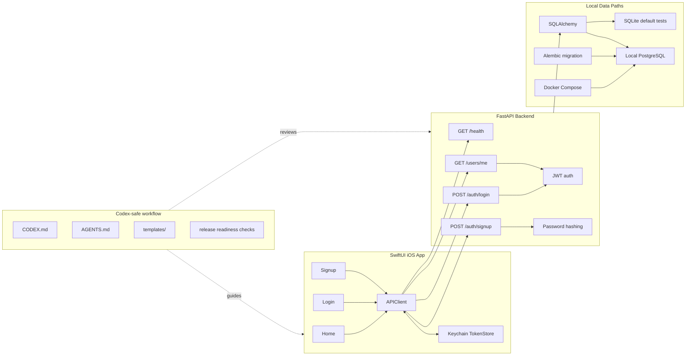

# ai-app-starter-swiftui-fastapi

[](https://github.com/Sena-lilly/ai-app-starter-swiftui-fastapi/actions/workflows/backend-tests.yml)
[](https://github.com/Sena-lilly/ai-app-starter-swiftui-fastapi/actions/workflows/ios-build.yml)
[](https://github.com/Sena-lilly/ai-app-starter-swiftui-fastapi/actions/workflows/docs-check.yml)

A production-minded starter kit for indie developers building iOS apps with SwiftUI, FastAPI, PostgreSQL, JWT authentication, Docker Compose, and Codex-friendly workflows.

## Project status

| Area | Status |
| --- | --- |
| Current phase | P8 public polish pass complete locally |
| Completed through | P8-B hardening plus public repo polish |
| Release state | pre-v0.1.0, no v0.1.0 tag or GitHub release yet |
| Production state | Production-minded, not production-ready |
| Default verification | Local backend tests, iOS simulator build, secret audit |
| Optional verification | Local iOS XCTest and Docker/PostgreSQL smoke test |

This repository contains repository design, documentation, a minimal runnable FastAPI backend, backend signup/login/users/me auth endpoints, local-only SQLite auth tests, configuration scaffolding, a SwiftUI app that can check backend health, log in, sign up, store an access token in Keychain, restore `/users/me`, and log out, local-only Docker Compose/PostgreSQL setup with Alembic migrations, reusable Codex-safe workflow guidance, CI foundations, release-readiness docs, and example walkthroughs. Refresh tokens and production deployment are intentionally deferred.

## Why this exists

Most starter kits show how to run code. This one also shows how to let Codex and other AI coding agents modify an app stack with reviewable boundaries, local-only verification, and explicit human confirmation before risky side effects.

It combines SwiftUI, FastAPI, JWT auth, Keychain token storage, Docker/PostgreSQL local development, Alembic migrations, CI foundations, and Codex-safe workflow docs in one small reference implementation. The goal is to help indie developers treat AI coding agents as development partners without letting them silently push, deploy, touch production data, create releases, or handle real secrets.

This project is a safer reference starter, not a production-ready application.

## What is this?

`ai-app-starter-swiftui-fastapi` is an open source starter kit for building a real iOS app stack with:

- SwiftUI for the iOS client
- FastAPI for the backend API
- PostgreSQL for persistent storage
- JWT-based authentication
- Docker Compose for local infrastructure
- Codex-friendly workflows for safer AI-assisted development

The goal is to give solo developers and small teams a practical foundation that is simple enough to understand, but structured enough to grow toward production.

This project is production-minded, but it is not production-ready yet.

## Who is this for?

This project is for:

- Indie iOS developers who want a backend-backed SwiftUI app starter
- Backend developers who want a clean FastAPI base for mobile apps
- Developers using Codex or other AI coding assistants who want guardrails
- Builders who prefer local-first development before production deployment
- OSS maintainers who want clear phase-based planning and release discipline

This project is not intended to hide the architecture behind a black box. It should teach the shape of the stack while giving you a useful starting point.

## What is implemented?

The repository currently includes:

- Repository-level documentation
- Architecture and design notes
- Codex workflow guidance
- Safety and security rules
- Roadmap and release checklist
- Minimal FastAPI backend under `backend/`
- Backend auth endpoints for signup, login, and `/users/me`
- SwiftUI app with local auth flow under `ios/`
- Local-only Docker Compose/PostgreSQL setup
- Minimal Alembic migration for the current `users` table
- Local-only iOS XCTest target for lightweight configuration, endpoint, DTO, and error-mapping checks
- Codex-safe workflow guidance in [CODEX.md](CODEX.md)
- AI coding agent role templates in [AGENTS.md](AGENTS.md)
- Reusable prompt templates in [templates/](templates/)
- Testing, CI, and release-readiness docs under [docs/](docs/)
- Example walkthroughs under [examples/](examples/)
- P8-A/P8-B release preparation docs, draft notes, hardening checks, and GitHub templates

## What is intentionally not included yet?

- Production deployment
- Refresh tokens
- Email verification
- Password reset
- OAuth
- Roles or permissions
- App Store/TestFlight workflow
- Production security audit

See [docs/known-limitations.md](docs/known-limitations.md).

## Architecture overview



Local Docker development uses Docker Compose for PostgreSQL and the backend service. The iOS app communicates with the local backend through configurable environment settings.

See [docs/architecture.md](docs/architecture.md) for the full design direction.

## Screenshots and demo assets

Screenshot capture is prepared in [docs/assets/screenshots/README.md](docs/assets/screenshots/README.md). README image links will be added after local simulator screenshots are captured and reviewed so the repository does not contain broken or stale visual assets.

## Quick Start

Current quick start:

1. Read this README.
2. Review [progress.md](progress.md) to understand the project phase checklist.
3. Read [docs/quickstart.md](docs/quickstart.md) for backend and iOS setup flows.
4. Use the [docs index](docs/README.md) to navigate design, testing, CI, release, and limitation docs.
5. Read [docs/testing.md](docs/testing.md), [docs/ci.md](docs/ci.md), and [examples/](examples/) for verification and usage examples.
6. Run `scripts/preflight-local.sh` for local release-prep checks when your environment has backend/iOS dependencies ready. Add `--with-ios-tests` or `--with-docker` when those local runtimes are available.
7. Use the templates in [templates/](templates/) when asking Codex to perform future phase work.

The current runnable surfaces are the backend health/auth endpoints and the SwiftUI health/auth app flow.

## Examples and release readiness

- Example walkthroughs: [examples/](examples/)
- Testing guide: [docs/testing.md](docs/testing.md)
- iOS testing plan: [docs/ios-testing.md](docs/ios-testing.md)
- Screenshot capture guide: [docs/assets/screenshots/README.md](docs/assets/screenshots/README.md)
- CI guide: [docs/ci.md](docs/ci.md)
- Secret audit: [docs/secret-audit.md](docs/secret-audit.md)
- Release readiness: [docs/release-readiness.md](docs/release-readiness.md)
- v0.1.0 draft notes: [docs/releases/v0.1.0-draft.md](docs/releases/v0.1.0-draft.md)
- Pre-release checklist: [docs/releases/pre-release-checklist.md](docs/releases/pre-release-checklist.md)

## Repository structure

```text
.
├── README.md
├── LICENSE
├── CONTRIBUTING.md
├── SECURITY.md
├── CODE_OF_CONDUCT.md
├── CHANGELOG.md
├── progress.md
├── .github/
├── docs/
├── examples/
├── scripts/
├── ios/
├── backend/
└── templates/
```

See each folder README or design document for its intended role.

## Roadmap

The project is organized into phases:

- P0 Repository Bootstrap
- P1 Backend MVP
- P2 iOS MVP
- P3 Auth Flow
- P4 Docker Local Setup
- P5 Codex Workflow Integration
- P6 Testing / Release Readiness
- P7 Examples
- P8 v0.1.0 Public Release

See [docs/roadmap.md](docs/roadmap.md) and [progress.md](progress.md).

## Relationship with codex-app-workflow

This project is related to [codex-app-workflow](https://github.com/Sena-lilly/codex-app-workflow).

`codex-app-workflow` is a workflow kit for using Codex safely in app development.

`ai-app-starter-swiftui-fastapi` is a working starter kit that applies those workflows to a SwiftUI + FastAPI + PostgreSQL app stack.

This repository should remain usable on its own. It may reference `codex-app-workflow` for process ideas, but it must not require that repository to run, build, test, or release.

## Codex-safe workflow

Codex-safe workflow is a first-class part of this project.

- Read [CODEX.md](CODEX.md) before asking Codex or another AI coding assistant to modify the repository.
- Use [AGENTS.md](AGENTS.md) to choose a review or implementation role.
- Use [docs/codex-workflow.md](docs/codex-workflow.md) and [templates/](templates/) for phase-based prompts, review prompts, handoffs, and safety footers.

These workflow files are inspired by `codex-app-workflow`, but this repository remains independently usable.

## Safety rules

Codex and other automation tools must not perform real-world side-effect operations without explicit human confirmation.

Do not execute the following without explicit human confirmation:

- GitHub repository creation
- `git init`
- `git commit`
- `git push`
- GitHub release creation
- Deployments
- External API calls
- App Store or TestFlight operations
- Production database connections
- Real database writes
- Real user data deletion
- Authentication credential generation or transmission
- Paid billing operations
- Production configuration changes

If a side-effect operation is needed, present the following first:

- Target
- Payload or operation details
- Impact scope
- Rollback plan

Preferred operating mode:

- Code review
- Procedure guidance
- Root-cause analysis
- Dry-run
- Local-only changes
- Test-first implementation
- Minimal diff
- Documentation-first planning

## Contributing

Contributions are welcome. Please read [CONTRIBUTING.md](CONTRIBUTING.md), [SECURITY.md](SECURITY.md), and [CODE_OF_CONDUCT.md](CODE_OF_CONDUCT.md) before opening issues or pull requests.

For now, changes should preserve the phase-based roadmap, keep local-only safety clear, and avoid presenting starter-kit code as production-ready.

## License

MIT License. See [LICENSE](LICENSE).
