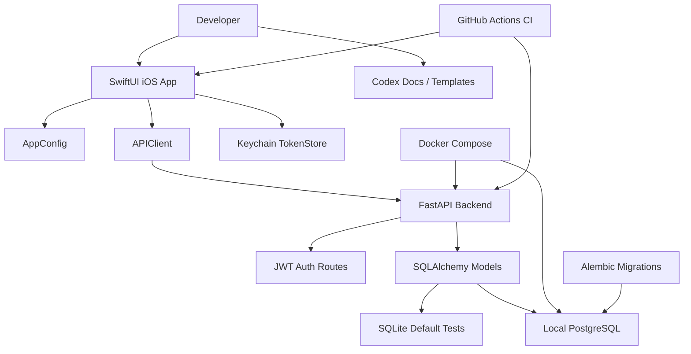

# Architecture

This document describes the current architecture and intended direction. P7 contains a minimal backend auth implementation, a SwiftUI auth flow, local-only Docker Compose/PostgreSQL support with Alembic migrations, Codex workflow guidance, CI foundations, and examples. P8-A adds release-preparation files, and P8-B adds release-candidate local preflight hardening; production-facing pieces remain deferred.

## High-level view

```text
SwiftUI iOS App
      |
      | HTTPS / JSON
      v
FastAPI Backend
      |
      | SQLAlchemy / migrations
      v
PostgreSQL
```

## Local development flow



## Components

### iOS app

The iOS app is built with SwiftUI. It currently contains:

- App shell
- Navigation structure
- API client
- Environment-specific backend URL configuration
- Login and signup API integration
- Keychain access token storage
- Session restore through `/users/me`
- Logout
- Backend health-check UI

Future phases should add:

- iOS tests
- Refresh token behavior if needed

### Backend API

The backend is built with FastAPI. It currently contains:

- Clear application entrypoint
- Health check endpoint
- Backend auth endpoints
- Configuration loading
- Request validation with Pydantic
- Database access layer
- Tests

### PostgreSQL

PostgreSQL is the target database for local Docker development. The repository includes an initial Alembic migration for the current `users` table.

### Docker Compose

Docker Compose supports local development with `backend` and `db` services. It should not be treated as production infrastructure.

### Testing and CI

Backend tests default to SQLite and do not require Docker or PostgreSQL. CI includes backend pytest, iOS simulator build, and docs/script check workflows. CI does not deploy, release, sign, upload, or connect to production systems.

## Boundaries

The iOS app should not know database details.

The backend should expose explicit JSON API contracts.

Authentication implementation should be isolated enough to test and revise.

Configuration should be environment-driven and should not contain real secrets in the repository.

## Deferred work

The following are intentionally deferred until later phases:

- Production-grade database operations
- Production deployment guidance
- Refresh tokens, email verification, password reset, OAuth, and roles
- iOS test target
